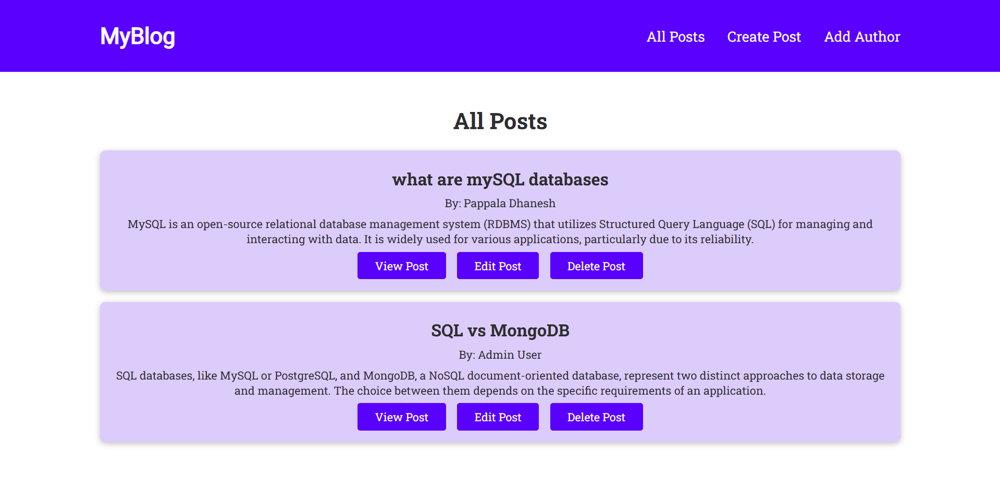

# Full-Stack Blog Project

Welcome to the Full-Stack Blog Project! This is a dynamic blogging web application that allows users to post, edit, delete, and view detailed information about blogs. The application is built using HTML, JavaScript, Node.js, SQLite, EJS, and CSS.



## Table of Contents
- [Features](#Blogsite-CRUD-features)
- [Getting Started](#getting-started)
  - [Prerequisites](#prerequisites)
## Features

- User-friendly web interface for creating, editing, and deleting blog posts.
- Detailed blog information, including author name, date, and time of creation.
- SQLite database for lightweight data storage (no external DB needed).
- Ability to add multiple authors and assign posts to each author.
- Responsive design for a seamless user experience.
- Clean and modular code structure using Express.js and EJS templates.

## Getting Started

To get a copy of this project up and running on your local machine, follow these steps:

### Prerequisites

- Node.js and npm installed on your machine.
- Git installed (optional, but recommended).
- No database setup required — SQLite is included.

### Installation

1. Clone this repository to your local machine (you can also fork it if you plan to contribute):

   ```bash
   git clone https://github.com/pappaladhanesh/Full-Stack-Blog-Project
     ```

2. Navigate to the project directory:
  ```bash
   cd Full-Stack-Blog-Project
  ```

3. Install dependencies:
  ```bash
   npm install
  ```

4. Initialize the SQLite database:
  ```bash
   node init-db.js
  ```

5. Run the development server:
  ```bash
   npm start
  ```

6. Open your browser and visit:
  ```bash
   http://localhost:3000
```
## You can check out the deployed MyBlog website at:
[full-stack-blog-project-production.up.railway.app](#full-stack-blog-project-production.up.railway.app)
